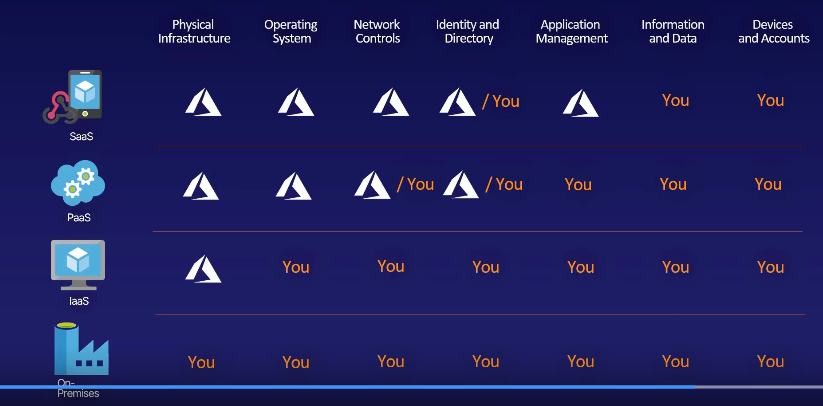

# Cloud Service Models

### Exam Tips

**Service is the core of Azure, and there are three main ways to go about it.**

- laaS provides servers, storage and networking as a service.

- PaaS is a superset of laaS and also includes middleware, such as database management tools.

- SaaS is when a service is built on top of PaaS, like Office 365.

- Serverless means that you don't have any servers. Let's a single function be hosted, deployed, run and managed on its own.

### Infrastructure-as-a-Service

- Actual servers

- Scaling is fast

- No ownership of hardware

### Platform-as-a Service

- Superset of IaaS

- Support web application life cycle

- Business Intelligence, database management system

- Avoids software license hell

### Software-as-a-Service

- Providing a managed service

    - Stripe (credit card payments)

    - Gmail
    
    - QuickBooks (Accounting)
    
    - Office 365
    
    - App Services
    
    - Azure Active Directory

- Pay an access fee to use

- No maintenance and latest features

### Serverless

- Azure Functions is a serverless service

- Extreme PaaS

- Hosted, Deployed, Run and Managed without having to maintain a full application.

## HOW TO IDENTIFY CLOUD SERVICE MODELS

| Model | Characteristics                                                                                   |  Examples                          |
| ----- | ------------------------------------------------------------------------------------------------- | ---------------------------------- |
| laaS  | Organization has complete control of the infrastructure.                                          | VM, VNet, Storage                  |
|       | Dynamic and flexible. You can do almost anything.                                                 |                                    |
|       | Cost varies depending on consumption.                                                             |                                    |
|       | Services are highly scalable.                                                                     |                                    |
|       | Multiple users share a single piece of hardware.                                                  |                                    |
| PaaS  | Resources are virtualized and can easily be scaled up or down as needed.                          | App Services, Azure CDN, Cosmos DB |
|       | Services often assist with the development, testing and deployment of apps.                       |                                    |        
|       | Multi-user access via the same development application.                                           |                                    |
|       | Integrates web services and databases.                                                            |                                    |
| SaaS  | Managed from a central location.                                                                  | Microsoft 365                      |
|       | Hosted on a remote server.                                                                        |                                    |
|       | Accessible over the internet.                                                                     |                                    |
|       | Users not responsible for hardware or software updates.                                           |                                    |
|       | Rate limiting/QoS.                                                                                |                                    |
|       |                                                                                                   |                                    |

## SHARED RESPONSIBILITY MODEL

