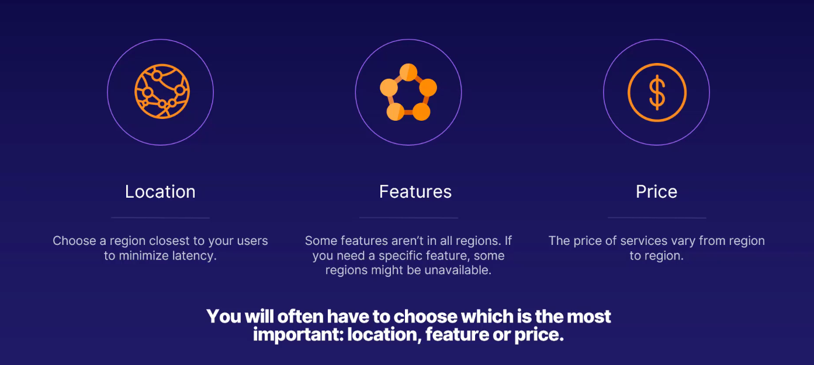

# Regions and Availability Zones

## Region Definition

Two or more data centers not too far from each other connected with a fiber connection.

### Broken Down

**A set of datacenters**:

- Each region has more than one data center, which is a physical location.

**Latency defined perimeter**:

- Latency is the time it takes data to travel.

- Also means that datacenters are not "too far" from each other.

**Regional low-latency network**:

- A fiber connection between data centers in the region.

## How to Choose a Region

### Paired Region

1. Each Region is Paired

Paired within same geographic area except Brazil South.

2. Outage Failover

If the primary region has an outage you can failover to the secondary region.

3. Planned Updates

Only one region in a pair is updated at any one time.

4. Replication

Some services used paired regions for replication.

## Availability Zones

**Physical Location**: Each availability zone is a physical location within a region.

**Independent**: Each zone has its own power, cooling and networking.

**Zones**: Each region has a minimum of three zones.