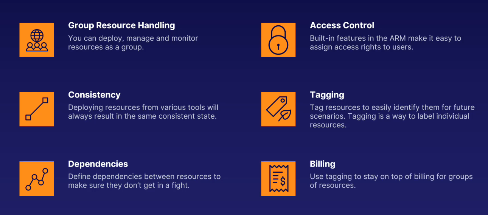

# Azure Resource Groups and Azure Resource Manager (ARM)

[⬆ Back to Parent](../03%20-%20Azure%20Architecture/README.md)
[🏠 Back to Root README (../../../../../../README.md)

## Parent Context

This document is part of the "Azure Architecture" module within the AZ-900 Microsoft Azure Fundamentals course.

## Contents Overview

This file explains two fundamental concepts in Azure architecture: Resource Groups and the Azure Resource Manager (ARM). It details their purpose, key characteristics of Resource Groups, and the overarching role and benefits of ARM in managing all Azure resources.

## Role in System

Resource Groups provide a logical container for related Azure resources, facilitating their management, monitoring, and deletion as a single unit. Azure Resource Manager acts as the deployment and management service for Azure, processing all requests to create, update, or delete resources, ensuring consistency and enabling advanced features like Infrastructure as Code.

## Key Concepts

### Resource Groups

Resource groups are containers that hold related resources for an Azure solution. They include those resources that you want to manage as a group.

#### Resource Groups Facts

-   **One Resource**: Each resource can only exist in a single resource group.
-   **Add/Remove**: You can add or remove resources to any resource group at any time.
-   **Move Resource**: You can move a resource from one resource group to another.
-   **Multiple Regions**: Resources from multiple regions can be in one resource group.
-   **Access Control**: You can grant users access to a resource group and everything in it.
-   **Interact**: Resources can interact with other resources in different resource groups.
-   **Location**: A resource group has a location, or region, as it stores metadata about the resources in it.

### Azure Resource Manager (ARM)

ARM is the underlying deployment and management service for Azure. All interactions with Azure resources—whether through the Portal, PowerShell, Azure CLI, REST APIs, or client SDKs—are processed through ARM.

#### ARM Benefits

## Summary

-   **Resource Groups**: All resources belong to a resource group. It isn't a resource itself but helps structure your Azure architecture.
-   **Azure Resource Manager**: All interaction with Azure resources goes through ARM. It is the main Azure Architecture component for creating, updating, and manipulating resources.
