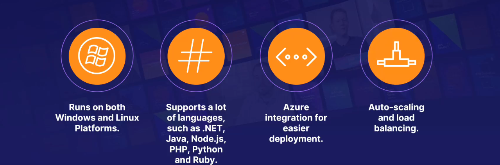

# App Services

- Fully Managed Platform

- Server, Network, Storage and other fundamental infrustructure is managed/handled by Azure.

- You just have to focus on `Business Value` and `Logic`

## <mark>EXAM TIPS</mark>

App services is an easy way to host and manage your web application.

- App services are a `PaaS` offering on Azure

- Web Apps are used to host web sites and web applications.

- Web Apps for Containers can host your exisiting container images.

- API Apps can host your data backend services.

## Three nain Categories

### Web Apps

Website and online applications hosted on Azure's managed platform.

### Web Apps for Containers

Deploy and run containerized applications in Azure.

### API Apps

Expose and connect your data backend.

