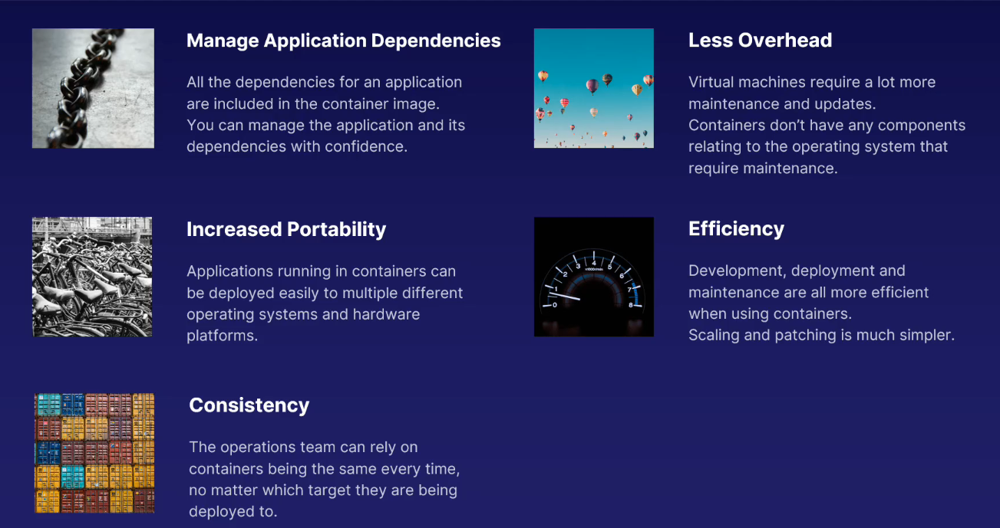

# Azure Container Instances

### Features

### Workflow

- Application is developed as usual using the **Software Development Cycle**

- When ready for being published **Application placed in a container**

- Which can then be deployed to **Azure Container Instances**

### Service

1. **User to Run Container Workloads**

- Primary Azure service for running container workloads.

- A workload is your process or application.

2. **On Demand = Save $$$**

- Use containerized applications to process data on demand, by only creating the container image when you need it.

- Save some cash in the process.

3. **Works With Your Tool of Choice**

- Use the Azure Portal, Azure CLI or Powershell.

- Whichever you like the most.
