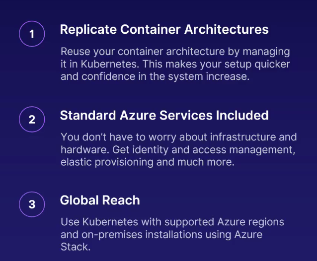
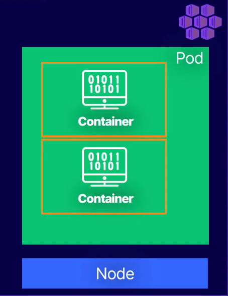

# Azure Kubernetes

### Definition Kubernetes

- Greek for `governor` or `captain`

- Conceived by Google

- `K8s`

### Azure Kubernetes Service

### Azure Container Registry (ACR)

- Keeps track of current valid container images

- Manages files and artifacts for containers

- Feeds container images to ACI and AKS

- Use Azure identity and security features

### Scenario

- Imagine you have an application that processes orders from customers.

- Application runs in a container which is created from an image in `ACR`.

- `ACR` has the conatiner images `AKS` is using.

- `AKS` manages the containers and has what is called a `Cluster`.

- A `Cluster` is a set of machines called `Nodes` that run containerized apllications managed by `Kubernetes`.

- A `Pod` is a group of 1/more containers with shared storage network and a specification for how to run the containers.

- The application for processing order lives in a `Pod`.

- When the number of orders increase and the current `Pod` or `Pods` can't keep up `Kubernetes` can automatically provision another `Pod` to take some of the load.

