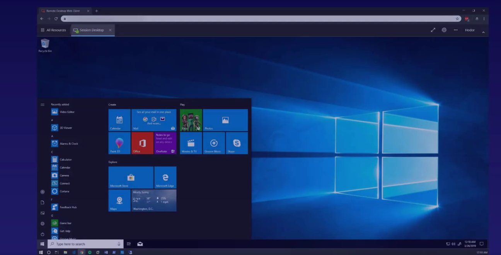

# Azure Virtual Desktop

### What Does it Look Like?

Runs on Azure

### Use Any VM You Want

- Runs on any VM except Linux

- Access from any device that has web browser

### Benefits

Azure Virtual Desktop is a completely virtualized version of Windows, meaning it runs 100% in the cloud.

