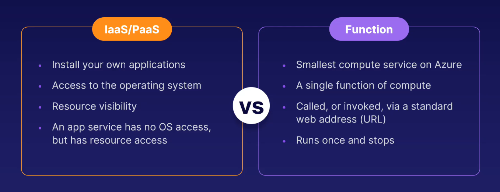
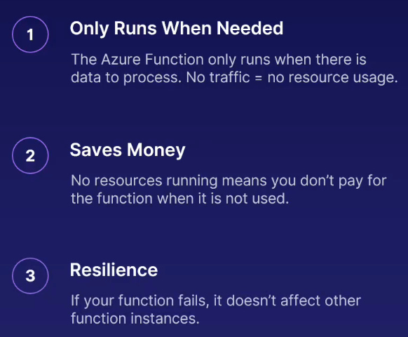

# Functions

### Architecture

- They use a virtual machine to run on in order to compute.

- No maintenance.

- No processes

- Nothing VM related

- Just focus on your functionality.

### Use Case

- Your business let's users upload pictures of their pets.

- These images need processing to both optimize them for web display and storage.

- When a user uploads an image through to your website, an `Azure Function` recieves that image.

- The `Function`'s job is to process the image to compress it and change it to the correct file format.

- The `Function` the stores the image in a database for future use in your online application.

### Benefits

