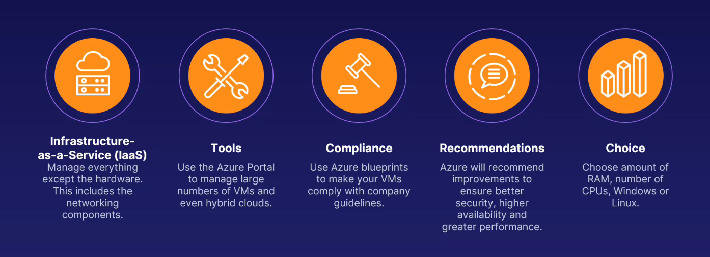
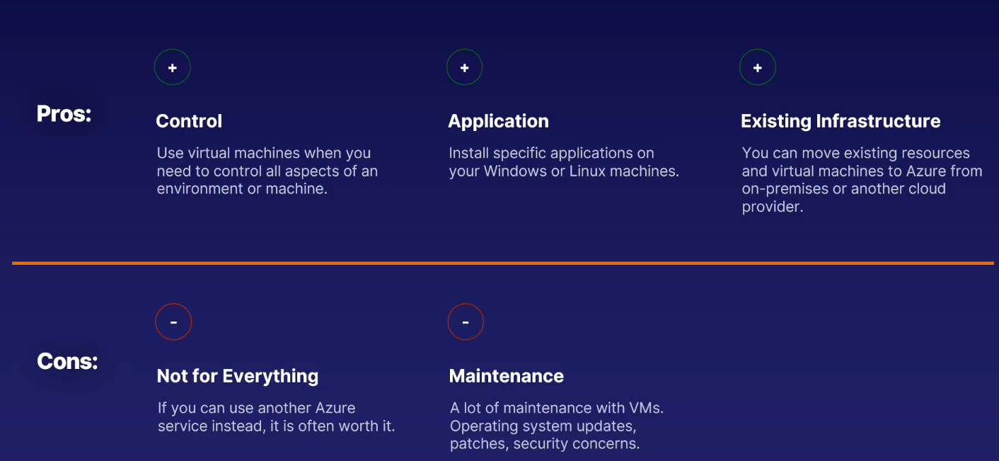

# Virtual Machines

## <mark>EXAM TIPS</mark>

Virtual Machines are the core of Azure compute and are widely used.

- A VM is your machine exclusively.

- You don't buy, own or control any hardware. Azure does this.

- VMs are an IaaS offering, where you are responsible for the entire machine.

- Azure VMs take advantage of Azure tools.

- Pricing goes up as resources go up, and you pay by the hour.

### What is a virtual machine?

- A compter or server you have access to exclusively.

- It doesn't have it's own exclusive hardware.

### Features

### Pricing

- Calculated Hourly.

- The more CPU's and RAM you need the more the costs.

### Use Cases

