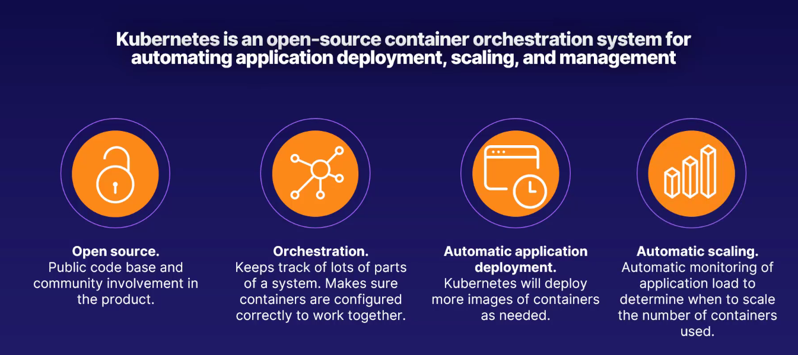
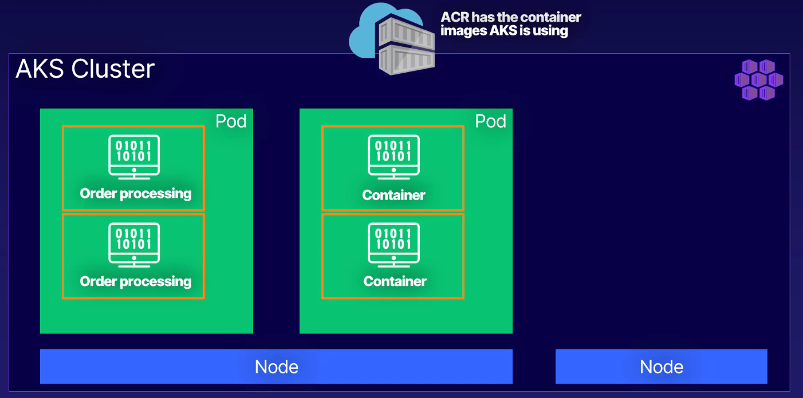

# Azure Kubernetes Service (AKS)

[⬆ Back to Parent](../04%20-%20Compute/README.md)
[🏠 Back to Root README (../../../../../../../README.md)

## Parent Context

This document is part of the "Compute Services" module within the AZ-900 Microsoft Azure Fundamentals course.

## Contents Overview

This file introduces Kubernetes and Azure Kubernetes Service (AKS), explaining core concepts such as Kubernetes definition, its origin, and the role of Azure Container Registry (ACR). It presents a scenario demonstrating how these services work together to manage and scale containerized applications using clusters, nodes, and pods.

## Role in System

AKS is a powerful managed container orchestration service that simplifies the deployment, management, and scaling of containerized applications. This document helps in understanding how AKS can be leveraged to build resilient, scalable, and highly available microservices architectures on Azure.

## Key Concepts and Services

### Definition: Kubernetes

-   Greek for `governor` or `captain`.
-   Conceived by Google, often abbreviated as `K8s`.
-   

### Azure Kubernetes Service (AKS)

-   A managed container orchestration service provided by Azure.
-   

### Azure Container Registry (ACR)

-   A managed, private Docker registry service in Azure.
-   Keeps track of current valid container images.
-   Manages files and artifacts for containers.
-   Feeds container images to ACI and AKS.
-   Uses Azure identity and security features.

### Scenario: Scaling an Order Processing Application

Imagine an application that processes customer orders:

1.  The application runs in a container, created from an image stored in `ACR`.
2.  `ACR` provides the container images that `AKS` uses.
3.  `AKS` manages the containers and utilizes a `Cluster`.
    -   A `Cluster` is a set of machines called `Nodes` that run containerized applications managed by `Kubernetes`.
    -   A `Pod` is a group of one or more containers with shared storage, network, and a specification for how to run the containers. The order processing application lives in a `Pod`.
    -   
4.  When demand (e.g., number of orders) increases, `Kubernetes` can automatically provision another `Pod` to handle the additional load, ensuring scalability.
    -   
