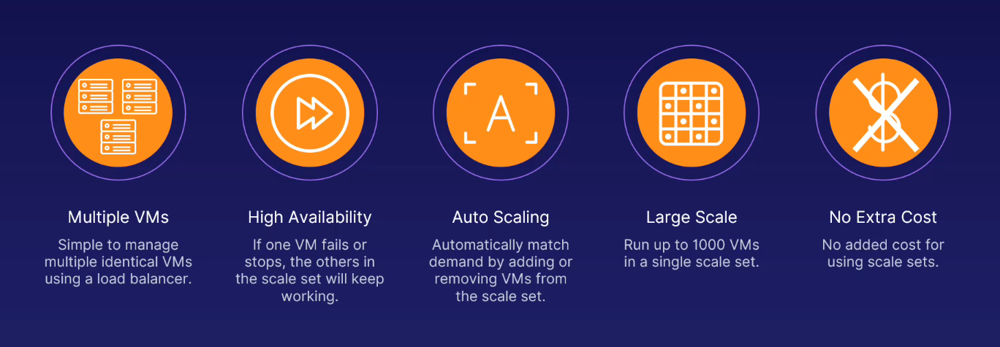

# Azure Virtual Machine Scale Sets

[⬆ Back to Parent](../04%20-%20Compute/README.md)
[🏠 Back to Root README (../../../../../../../README.md)

## Parent Context

This document is part of the "Compute Services" module within the AZ-900 Microsoft Azure Fundamentals course.

## Contents Overview

This file introduces Azure Virtual Machine Scale Sets (VMSS), explaining how they allow you to create and manage a group of identical, load-balanced virtual machines. It covers the core concept of using a baseline VM to instantiate many clones, exam tips for understanding their benefits, and an image illustrating these advantages.

## Role in System

VM Scale Sets are a crucial component for building highly available and scalable applications on Azure. This document explains how they automatically manage and scale VM instances based on demand, ensuring applications remain responsive and resilient to failures, thereby simplifying operational overhead.

## Key Concepts and Features

### Definition

-   Azure Virtual Machine Scale Sets let you create and manage a group of identical, load-balanced virtual machines.
-   You provide a single VM as a baseline (a template or image) for your Scale Set, and then you can create multiple VMs instantly from that.
-   These are essentially clones of VMs designed to work together to handle application loads.

### EXAM TIPS

Scale sets are about taking VMs to the next level and maintaining operational sanity.

-   Scale sets comprise identical VMs that can be activated or deactivated as needed, automatically.
-   A baseline VM for the scale set ensures application stability. This baseline VM is the blueprint from which all other scale set VMs are copied.
-   As resource usage increases, more VMs are automatically activated to handle the load.
-   You only pay for the VM, storage, and networking resources you use; there are no additional charges specifically for the scale set feature itself.

### Benefits

Azure Virtual Machine Scale Sets offer significant advantages for application deployment:

-   