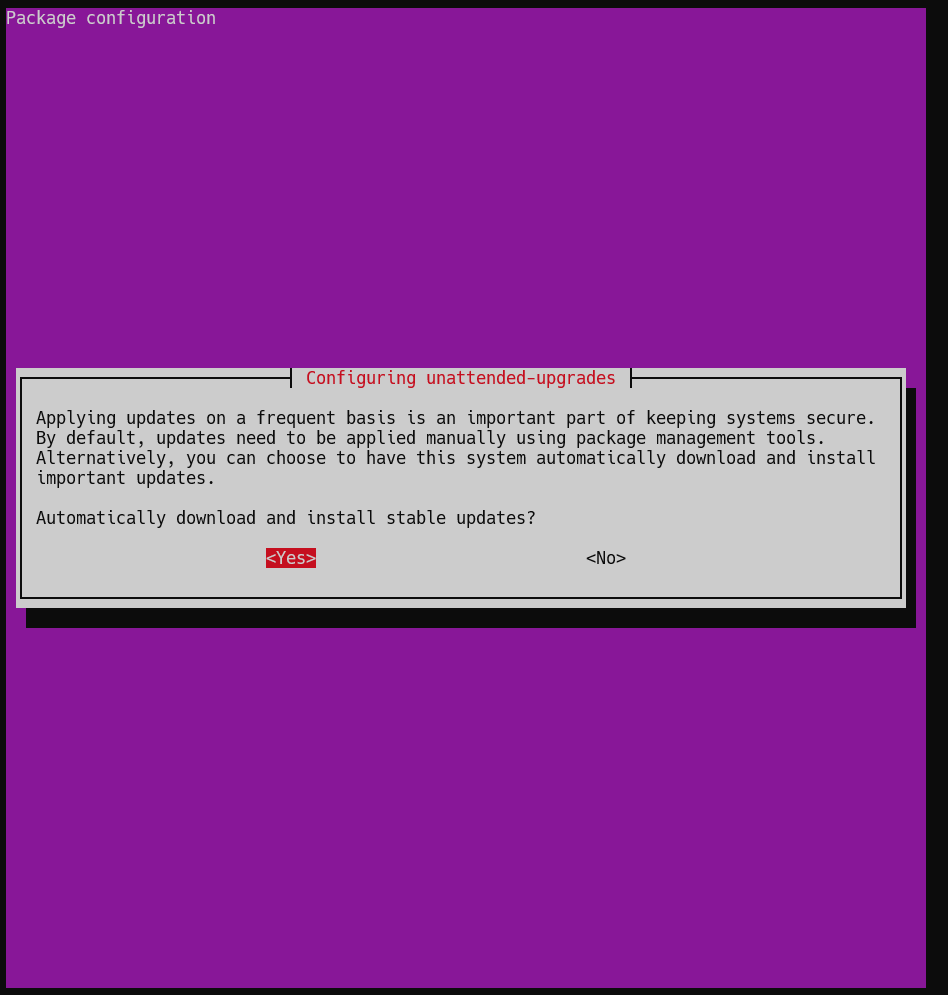

# Secure Linux Server

1. Enable Automatic Updates
2. Create a Limited User Account
3. Passwords are too weak
4. Lockdown Logins (harden ssh)
5. FIREWALLS

## Get a linux Server

Options:
  - Linode (100$ free credit for a year)
  - AWS Lightsail (first 3 months free, 3$ after that)

Connect to Lightsail instance via ssh:
  - https://lightsail.aws.amazon.com/ls/docs/en_us/articles/amazon-lightsail-ssh-using-terminal
  
## Enable Automatic Updates
  
  ```bash
  apt install unattended-upgrades
  ```

  ```bash
  dpkg-reconfigure --priority=low unattended-upgrades
  ```

  

  Pick `<Yes>`

## Create a Limited User Account

  - Create a user:
    ```bash
    adduser <user>
    ```

  - Add user to the sudo group
    ```bash
    usermod -aG sudo <user>
    ```

## Get rid of Password

  - Create directory to store public keys
    ```bash
    mdkir !/.ssh && chmod 700 ~/.ssh
    ```
      - `chmod 700` just changes the file privilegdes 

  - Generate public key pair
    ```bash
    ssh-keygen -b 4096
    ```
    
    

  - Upload public key to linux Server
    ```bash
    scp $ENV:USERPROFILE/.ssh/id_rsa.pub <username@public-ip-address>:~/.ssh/authorized_keys
    ```

## Lockdown Logins
  
  - 
